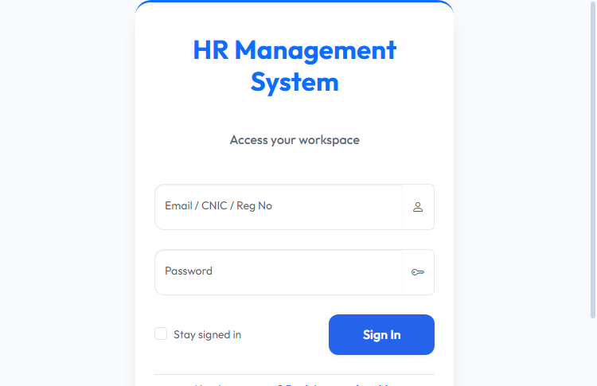
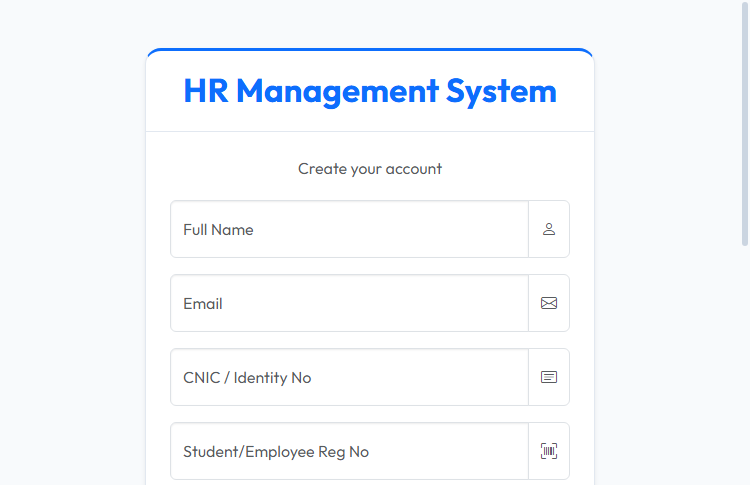

# HR Management & University ERP System

A full-featured HR and University Enterprise Resource Planning platform built for role-based access, leave management, academic administration, and dynamic system control.

The application is designed to support multi-role workflows for Super Admin, Faculty, Staff, and Students while offering an easy-to-maintain folder structure and a responsive Bootstrap/AdminLTE frontend.

---

## 📸 Screenshots

Login page:

Registration page:

---

## ✨ Key Features

- Role-based access control (RBAC) with dynamic sidebar generation
- User authentication and secure session handling
- User management, department assignment, and role mapping
- Leave application submission, review, and approval workflows
- Subject and faculty assignment for academic operations
- Modular API endpoints for backend data operations
- Responsive Bootstrap 5 / AdminLTE-based UI

---

## 🧩 Technical Stack

- **Backend**: PHP 8.x with PDO
- **Frontend**: Bootstrap 5, AdminLTE 4, vanilla JavaScript, custom CSS
- **Database**: MySQL / MariaDB
- **Auth**: Session-based login with role access control
- **Server**: XAMPP-compatible local PHP development environment

---

## 📁 Project Structure

- `api/` — backend API endpoints for AJAX-driven features
- `assets/` — CSS, JavaScript, and theme resources
- `core/` — authentication, configuration, database connection, and session utilities
- `dashboards/` — role-specific portal pages for faculty, staff, student, and super admin
- `includes/` — shared header, footer, and sidebar templates
- `uploads/` — uploaded files and user assets
- `tmp/` — temporary files and caches

Important root pages:

- `index.php` — entry point, redirects to the login experience
- `login.php` — user login page
- `register.php` — user registration page
- `logout.php` — session logout handler
- `profile.php` — user profile page

---

## 🚀 Future Integration Ideas

- Payroll automation with salary profiles, tax calculation, and payslip generation
- Attendance tracking with biometric and manual attendance features
- Email and SMS notification workflows for leave approvals and alerts
- Student course registration, grading, and exam scheduling modules
- Dashboard analytics and reports using charts and visual summaries
- Document management for HR and academic records
